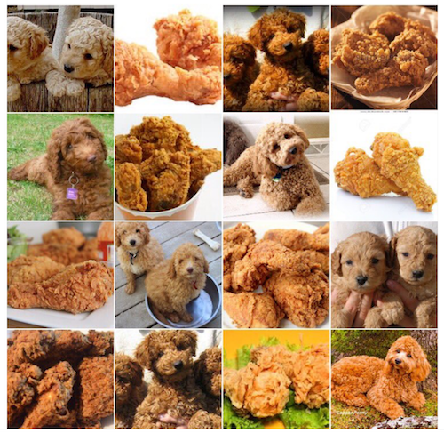

# Poddle Dogs Vs. Fried Chicken Wings

Figure credit: Twitter @teenybiscuit

## Data Generation

We randomly collected 500 images with search word "**brown poddle dogs**"" and 500 images with search word "**fried chichen wings**" from Google Image Search. We downloaded the top-rank search results and filtered out the unqualified ones, such as wrong subjects, images that are too small or too large, black-and-white images. We then converted all images to .jpg format. The raw images can be found in the [./data/images/]() folder.

## Data Processing

We randomly split the entire set of images into 70% training images and 30% images. The testing image ID is given in ... Since the images of difference sizes and the objects in these images have different compositions, backgroungs, lighting conditions and etc., we use the SIFT (Scaled Invairant Feature Transformation) as input feature vectors. In this image set, we use a vocabulary of size 5000. The extraction of SIFT features is implemented by [Vlfeat in](http://www.vlfeat.org/) MATLAB by adapting [this codes](http://www.vlfeat.org/applications/caltech-101-code.html). Our SIFT extraction code is located [here](). The output feature matrix for both training and testing images is saved as a sparse matrix format in the [CSV file](./data/sift_feature_pf.csv) to reduce storage cost. 

## Feature Visualization

 